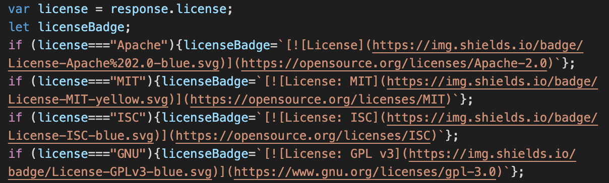
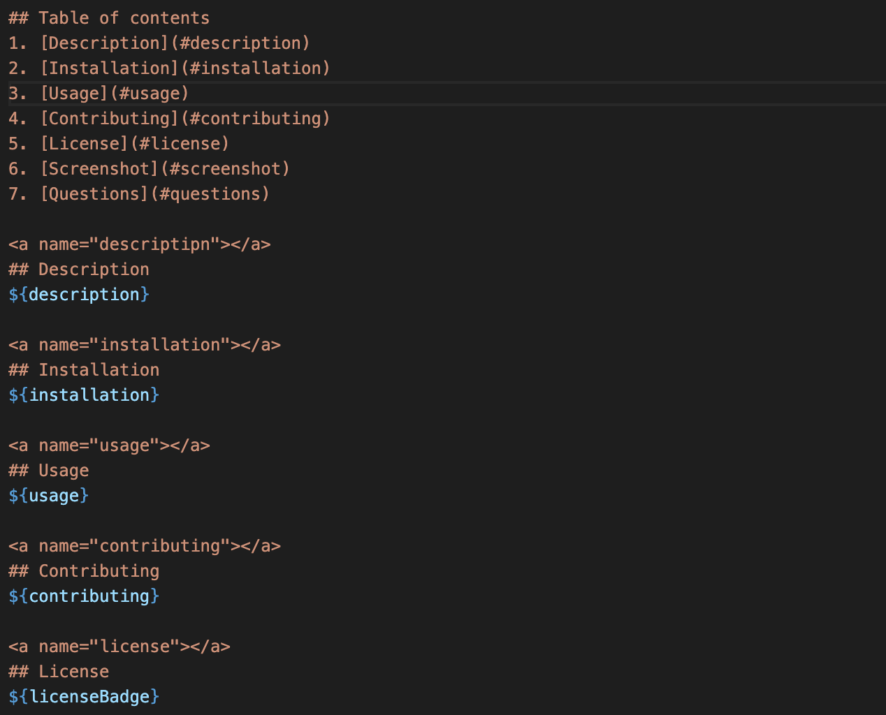

# Good README Generator
[](https://opensource.org/licenses/MIT)

## Table of contents
1. [Description](#description)
2. [Installation](#installation)
3. [Usage](#usage)
4. [Contributing](#contributing)
5. [License](#license)
6. [Screenshot](#screenshot)
7. [Technology Used](#technology)
8. [Questions](#questions)
9. [Links](#links)
    
<a name="descriptipn"></a>
## Description
This project will generate a README.MD file to proper README standards.
### User Story
**AS** A developer<br>
**I WANT** a README generator<br>
**SO THAT** I can quickly create a professional README for a new project<br><br>
### Acceptance Criteria
**GIVEN** a command-line application that accepts user input<br><br>
**WHEN** I am prompted for information about my application repository<br>
**THEN** a high-quality, professional README.md is generated with the title of my project and sections entitled Description, Table of Contents, Installation, Usage, License, Contributing, Tests, and Questions<br><br>
**WHEN** I enter my project title<br>
**THEN** this is displayed as the title of the README<br><br>
**WHEN** I enter a description, installation instructions, usage information, contribution guidelines, and test instructions<br>
**THEN** this information is added to the sections of the README entitled Description, Installation, Usage, Contributing, and Tests <br><br>
**WHEN** I choose a license for my application from a list of options<br>
**THEN** a badge for that license is added near the top of the README and a notice is added to the section of the README entitled License that explains which license the application is covered under<br><br>

For this bit of code I ran a series of conditional statements that would return different badges when one is selected. <br><br>
**WHEN** I enter my GitHub username<br>
**THEN** this is added to the section of the README entitled Questions, with a link to my GitHub profile<br><br>
**WHEN** I enter my email address<br>
**THEN** this is added to the section of the README entitled Questions, with instructions on how to reach me with additional questions<br><br>
**WHEN** I click on the links in the Table of Contents<br>
**THEN** I am taken to the corresponding section of the README<br><br>

For this I just simply made a link for each table of contents item with an ID and called on that ID in the ```<a>``` tags for each section. 


    
<a name="installation"></a>
## Installation
1. Make sure you have node.js installed<br>
2. type in "npm install inquirer" into the command line
    
<a name="usage"></a>
## Usage
In the command line type in “node index.js” and fill out the prompts
    
<a name="contributing"></a>
## Contributing
My code is open source so feel free to make it your own!
    
<a name="license"></a>
## License
[](https://opensource.org/licenses/MIT)

<a name="screenshot"></a>
## Screenshot


<a name="technology"></a>
## Technology Used
1. Javascript
2. Node.js
3. Inquirer
    
<a name="questions"></a>
## Questions
Feel free to check out my [GitHub](https://github.com/pattymcpat) repository. Also feel free to send me an email at <patrickly72@gmail.com> if you have any questions

<a name="links"></a>
## Links
1. [GitHub Repository](https://github.com/pattymcpat/readme-generator/)<br>
2. [Video](https://youtu.be/iAoNAyz4fy8)
